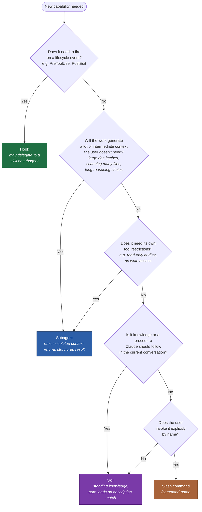

# Build your own Claude Code plugin

*A guide for Temporal / TypeScript engineers who want to ship a Claude Code plugin to their team. Written by someone who just did it. Plan on ~20 minutes of research and an afternoon of building.*

## 1. Find the gap before you build

Engineers default to building. Resist that for one sitting. Open [claudemarketplaces.com](https://claudemarketplaces.com/) and [skills.sh](https://www.skills.sh/) and search your problem space — broad terms first (*"deterministic checks"*, *"pre-push validation"*), then narrow (*"Temporal"*).

You're looking for two things:

- **Missing capability** — nothing on the marketplace covers it.
- **Undiscoverable capability** — Temporal *has* a great official skill, but a Temporal newcomer won't find it. A plugin that triggers the right skill at the right moment is just as valuable as one that adds new behavior.

The signal worth chasing: **a common error your users hit that you can catch one step earlier.** The temporal-replay-guard plugin exists because non-determinism errors usually get caught in a GitHub branch; the plugin moves the catch back to `git push`.

## 2. Read the docs, not the tutorials

Two URLs are worth ~10 minutes:

- [Plugins: when to use plugins vs standalone configuration](https://code.claude.com/docs/en/plugins#when-to-use-plugins-vs-standalone-configuration) — tells you if a plugin is even the right primitive.
- [Plugins reference](https://code.claude.com/docs/en/plugins-reference) — the schema for `plugin.json`, hook events, slash commands, the whole surface.

> Tutorials have a finite runtime, so creators only highlight what *they* think matters. Docs have to cover everything. Skim the docs first; you'll find capabilities a video would never mention.

## 3. Skill first. Plugin only if a skill can't do the job.

Default to a new skill in `~/.claude/skills/`. CLAUDE.md stays clean and your team isn't on the hook to maintain another plugin. **Escalate to a plugin only when you need something a skill alone can't deliver** — a hook, a slash command, or distribution to a team.

### Skill vs. subagent — pick the right primitive for the work

Once you're inside a plugin, you have another decision: should this be a **skill** (knowledge that runs in the current conversation) or a **subagent** (a worker that runs in its own isolated context)? The wrong choice won't break the plugin, but it will either pollute your main context with intermediate noise or fragment knowledge that should stay together.

The axis that actually matters is **where the work runs**, not how many steps it has. A skill can be a multi-step procedure; a subagent can do one atomic thing. What separates them is context isolation. Multi-step work *tends* to become a subagent because intermediate steps generate noise — but that's a consequence, not the rule.

A useful gut check: **"do I want Claude to do this in my workspace, or hand it off to a contractor who brings back a deliverable?"** If the scratch paper matters to you, it's a skill. If only the final report matters, it's a subagent.

Concretely, in the temporal-replay-guard plugin from this guide:

- The `git push` interception is a **hook** — it fires on a lifecycle event.
- The replay-failure diagnostician is a **subagent** — it fetches two large Temporal docs and reads workflow source, and you only want the final diagnosis back, not the research.
- The determinism rules ("no `Date.now()` in workflows, gate command-graph changes with `patched()`") are a **skill** — standing knowledge Claude follows while you're editing.
- `/replay-check` is a **slash command** — explicit manual entry point.

All four primitives, each doing the job it's best at.

## 4. Let Claude build it; you review

I knew *what* I wanted, so my first prompt was short:

> *"Create a plugin that hooks into `git push`. It should run a check on the diffed code and block the push if the change would cause Temporal non-determinism errors in production."*

Two steering tricks worth stealing:

- **When Claude flounders on a script, transfer the full context.** Mine got stuck building the shell script that downloads workflow histories. I copied the entire troubleshooting conversation into a fresh chat so the new session had the same mental model. Unstuck in minutes.
- **When a hook silently doesn't fire, ask Claude what to log.** It will add structured logging to a file like `.claude/<plugin>.log`. Saves an hour of guessing.

**Review checklist** before merging anything Claude generated:

- Anything touching secrets or env files.
- Destructive operations (`rm`, `git push --force`, file deletes).
- Code-quality patterns — e.g. swap `Promise.all` for `Promise.allSettled` so one failure doesn't take down the rest.

## 5. Pick the trigger that demands the least user effort

The point of a plugin is to *remove* friction. Don't make the user run a slash command they'll forget — wire the check into something they already do. `PreToolUse` on `git push` was the right call for replay-guard because the user can't bypass it without noticing.

Ask: *what does my user already type? Can I attach to that?*

## 6. Ship via a private GitHub repo (or your internal marketplace, if you have one)

For internal rollouts, a private GitHub repo your team installs from is enough. If your company has an internal Claude Code marketplace, use it — discoverability is the limiting factor on adoption.

---

## Worked example: "Does my Node.js code have a memory leak?"

Sometimes the right answer is *don't build anything*. Run the same playbook:

1. **Gap check** — open [skills.sh](https://www.skills.sh/) and search *"memory"*. There's a good chance a Node.js memory-profiling skill already exists. Click through to the source.
2. **Vet the source before you install.** A skill runs with your shell's permissions. Read what it actually does:
   - Does it touch `.env`, `~/.aws/`, `~/.ssh/`, or any credential path?
   - Does it shell out (`curl`, `wget`, raw `fetch`) to a domain you don't control?
   - Does it run destructive commands (`rm`, `git push --force`)?

   There have been malicious skills published that quietly read `.env` and exfiltrate it. Treat every unknown skill the way you'd treat an npm package from a stranger.
3. **Sandbox first run.** If the skill is new to you, run it inside a container or a scratch repo with no real secrets. Confirm the behavior matches the description before you let it loose on a real project.
4. **Now you decide.** Does it solve the problem? Drop it in `~/.claude/skills/` and move on. If it's close but not quite right — *that's* your gap. Now you can fork it or wrap a plugin around it.

The takeaway: "build your own plugin" sometimes means "adopt someone else's skill, safely." Step 1 of this guide is doing its job when it talks you out of building.