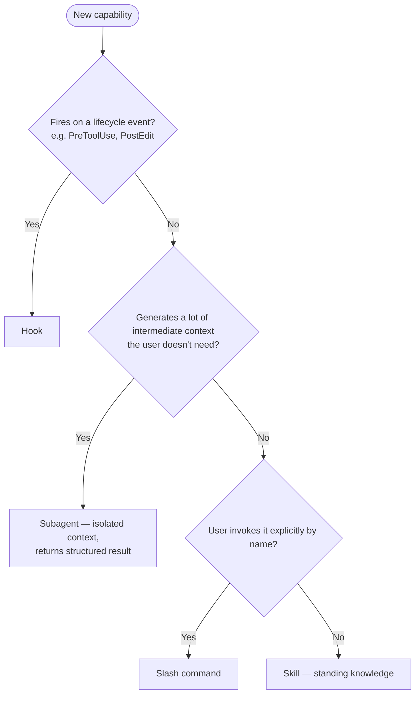

# Build your own Claude Code plugin

*For Temporal / TypeScript engineers who want to ship a plugin to their team. Plan on ~20 minutes of research and an afternoon of building.*

## 1. Look before you build

Search [claudemarketplaces.com](https://claudemarketplaces.com/) and [skills.sh](https://www.skills.sh/) first. A great existing skill you drop in `~/.claude/skills/` is faster than building. The signal worth chasing: **a common error you can catch one step earlier.** `temporal-replay-guard` moves non-determinism detection from a GitHub CI failure back to `git push`.

## 2. Skill first. Plugin only if a skill can't do it.

A skill in `~/.claude/skills/` keeps CLAUDE.md clean and has no maintenance burden. **Escalate to a plugin only when you need a hook, a slash command, or team distribution.**

Once you're inside a plugin, pick the right primitive:

Gut check: **"do I want Claude to work in my context, or hand off to a contractor who brings back a result?"** Scratch paper matters → skill. Only the report matters → subagent.

In `temporal-replay-guard`: `git push` interception is a **hook**, replay-failure diagnosis is a **subagent** (fetches two large docs — you only want the result back), determinism rules are a **skill** (auto-loads while editing), `/replay-check` is a **slash command** (explicit entry point).

## 3. Let Claude build it; you steer

Prompt with *what*, not how:

> *"Create a plugin that hooks into `git push`, runs a replay check, and blocks the push on failure."*

Two steering tricks worth stealing:
- **When Claude flounders on a script**, copy the full troubleshooting conversation into a fresh chat. A new session with the same context unblocks it faster than continuing in the broken thread.
- **When a hook silently doesn't fire**, ask Claude to add logging to `.claude/<plugin>.log`.

Review before merging: secrets/env files, destructive ops (`rm`, force push), and async patterns (`Promise.allSettled` vs `Promise.all`).

## 4. Wire to what users already do

Attach to an existing action rather than adding a slash command they'll forget. `PreToolUse` on `git push` is invisible friction reduction. Ask: *what does my user already type?*

## 5. Ship via a private GitHub repo

For internal rollout, a private repo your team installs from is enough. If your org has an internal marketplace, prefer it — discoverability is the adoption bottleneck.

---

**Before installing any external skill:** read the source. Check for references to `.env`, `~/.aws/`, `~/.ssh/`, or network calls to unfamiliar domains. Treat unknown skills the way you'd treat an npm package from a stranger — sandbox the first run.
